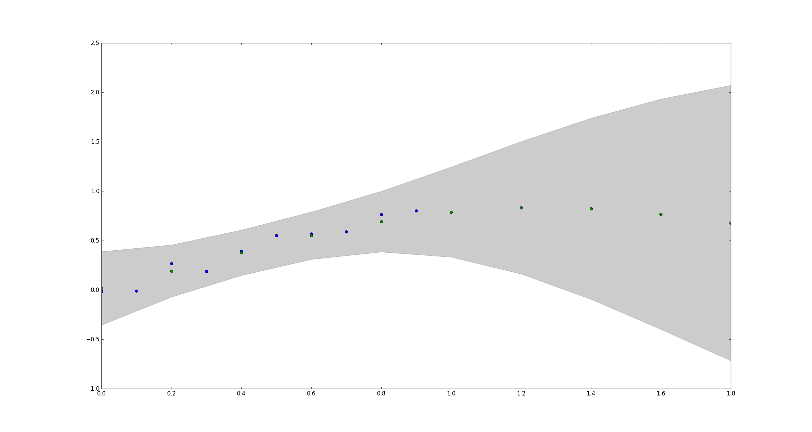

# Implementation of Gaussian Process Regression

### Current status

Completed simple Gaussian process regression (without sparse version). 

The result on sin wave is shown in the figure below. The training samples are generated from sin function with addition of Gaussian noise. The ten blue dots are training samples and ten green dots are the predictions. The shaded gray area represents plus and minus 2 standard deviations. The uncertainty increases in the region with less training data.

